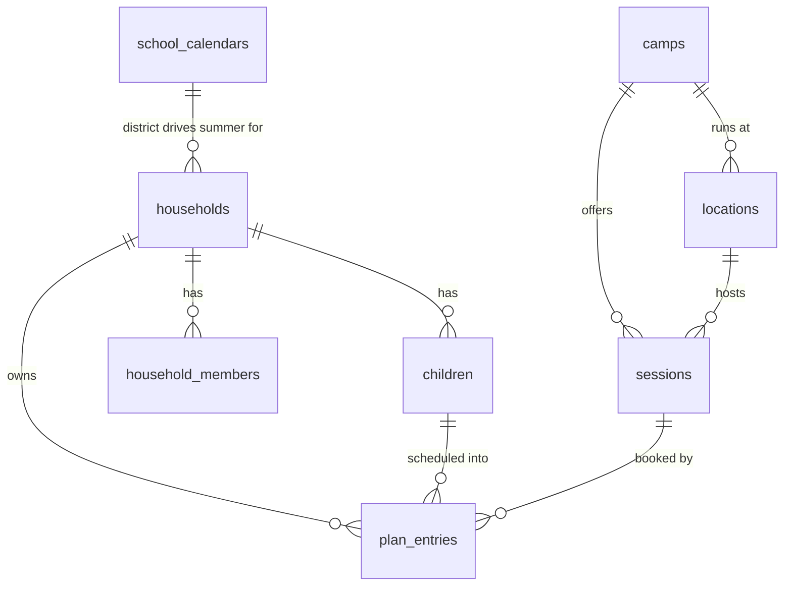

# Architecture

## Tech stack

| Layer | Choice | Notes |
|---|---|---|
| App | **Next.js 16 (App Router) + React 19**, TypeScript | Server Components read the catalog; Client Components own the grid and map. Hosted on Vercel. ADR-0003 |
| Database | **Supabase Postgres** | Normalized relational. Migrations in `supabase/migrations/`, committed and reviewed. ADR-0002 |
| Geo | **PostGIS** `geography(Point,4326)` + GiST | Proximity is one indexed `ST_DWithin`. Geocoding happens at verification time, never at query time. ADR-0007 |
| Auth | **Supabase Auth** (magic link) | The JWT drives RLS. ADR-0004 |
| Authorization | **Row Level Security** | The only boundary between households. Tested, not assumed. ADR-0004 |
| Files | **Supabase Storage** | Source PDFs captured when a record is verified. |
| Planner | **`@campout/planner`** (pnpm workspace, `private: true`) | Pure TS, no I/O, no clock. Runs server-side and in the browser. ADR-0008 |
| Maps | **MapLibre GL** + MapTiler tiles | Open-source renderer; tile provider swappable behind one env value. ADR-0007 |
| Styling | **Tailwind v4** + shadcn/ui | Tokens land with the directory UI. |
| Tooling | Biome · tsc · Vitest · Playwright · Lefthook | ADR-0009 |
| Package manager | pnpm 11, Node 24 | `.nvmrc` pins 24. |

See `docs/adr/` for the "why" behind each choice.

## The two shapes that matter

**A camp is an organization. A session is a dated offering.** The directory searches *sessions* — a parent shops for "the week of July 12", not for an organization. A camp page lists its sessions. Nearly every planner query starts at `sessions`, and getting this wrong would be the most expensive schema mistake available.

**Every catalog record carries provenance.** `verified_at` and `verified_by` are `NOT NULL` on `camps`, `sessions`, and `school_calendars`. A check constraint — `*_provenance_present` — requires that **at least one of `source_url` and `source_document_path` is non-NULL**. That is the whole of what the database enforces: neither column being set is impossible, and nothing more is checked.

Everything else about evidence is a contract the verification workflow keeps, not a rule the database applies (ADR-0012):

- `source_document_path` holds an **object key inside the private `camp-sources` bucket**, with no bucket prefix. The constraint does not parse it.
- **Nothing verifies the object exists.** A path pointing at a file nobody uploaded satisfies the constraint. Keeping the two in step is the verifier's job, and a dangling path is a data-quality bug rather than something Postgres will catch.

Together this is how "we list camps, we do not vet them" is made true in the data rather than merely stated in the terms. `website_url` and `registration_url` are deliberately nullable: plenty of camps have no site and take registration by paper or phone.

## Data model

**Two halves with different rules:**

- **Catalog** (`camps`, `locations`, `sessions`, `school_calendars`) — world-readable, writable only by the service role. Keeping the public half out of the policy surface keeps the policies that matter small enough to reason about.
- **Household** (`households`, `household_members`, `children`, `plan_entries`) — RLS-protected, resolved through `is_household_member()`. ADR-0004.

`children` holds a display name, an integer age, and a grade. **Nothing else, by design and by schema** — read ADR-0006 before altering that table.

## Planner package (`@campout/planner`)

At `packages/planner/`. Pure, framework-free TypeScript — no database client, no `fetch`, no React, no `process.env`, and **no reading of the wall clock**.

**Dual-use:** a route handler imports it to validate a plan; the browser imports it so the grid re-evaluates instantly as a parent drags a session into a cell. One implementation, two contexts.

**Enforced structurally, not by convention.** `packages/planner/tsconfig.json` compiles under `lib: ["ES2022"]` with **no DOM lib**, so a browser API inside the package is a compile error rather than a runtime failure on the server.

**The coverage primitive is a closure, not a summer (ADR-0013).** A closure is a contiguous run of days school is shut, carrying the district’s own reason. Summer is one of them, distinguished by `kind` and length — not by having its own type. `SchoolCalendar` and `SummerWeek` are replaced by `SchoolYearCalendar`, `Closure` and `CoveragePeriod`; `weeks.ts` keeps its partial-boundary-week logic behind `weeksBetween(start, end)`. `school_calendars` splits into a calendar row plus a `school_closures` child table. **The shipped code still carries the old shape** — ADR-0013 landed ahead of the implementation. On the catalog side there is nothing to do: a one-day camp is already a `sessions` row with `start_date == end_date`.

**Dates are calendar dates.** `YYYY-MM-DD` strings, anchored to UTC midnight internally — not to make the values UTC, but to make the arithmetic immune to the reader's timezone. A camp running June 15–19 runs those days in Richmond no matter who is looking. Daily hours are wall-clock `time` values. Money is integer cents.

| Module | Status | Responsibility |
|---|---|---|
| `calendarDate.ts` | **shipped** | Date primitives: parse/validate, `addDays`, `mondayOf`, `nextWeekday`, `previousWeekday`. Rejects `2027-02-30`, which `Date.parse` silently rolls to March 2. |
| `weeks.ts` | **shipped** | `summerWeeks()` — a district calendar in, the ordered weeks of summer out, with partial boundary weeks flagged. `summerWeekIndexOf()` maps a date to a grid column. |
| `types.ts` | **shipped** | `SchoolDistrict`, `SchoolCalendar`, `SummerWeek`. |
| `closures.ts` | not yet written | Resolves a district calendar into `CoveragePeriod`s — every run of days school is closed, summer included. Becomes the module everything else indexes off. ADR-0013 |
| `coverage.ts` | not yet written | Uncovered weeks. |
| `overlap.ts` | not yet written | Two sessions for one child on the same day. |
| `hours.ts` | not yet written | A session ending before the household workday does. |
| `logistics.ts` | not yet written | Two children too far apart for one drop-off run. |

## Key files

| Path | Purpose |
|---|---|
| `AGENTS.md` | The working contract. Read before anything else. |
| `docs/adr/` | Decisions and rationale; immutable once accepted. |
| `docs/data/camp-record-spec.md` | Field-by-field catalog spec and the verification rules. |
| `docs/DESIGN.md` | Visual language — tokens, card anatomy, state signals, copy. Proposed, not locked. |
| `supabase/migrations/…_catalog.sql` | `camps`, `locations`, `sessions`, `school_calendars`, PostGIS, catalog RLS |
| `supabase/migrations/…_source_documents.sql` | The private `camp-sources` bucket holding saved flyers, PDFs and screenshots (ADR-0012) |
| `supabase/migrations/…_households.sql` | `households`, `household_members`, `children`, `plan_entries`, `is_household_member()`, household RLS, and `create_household()` — the only path to a household (ADR-0011) |
| `packages/planner/src/` | The pure coverage engine (ADR-0008) |
| `src/app/page.tsx` | Placeholder landing page; proves the planner-in-a-Server-Component seam. |
| `.claude/hooks/tdd-guard.sh` | Test-integrity + ratchet guard (blocks the turn) |
| `.claude/hooks/privacy-guard.sh` | Child-data, RLS, and service-role guard (blocks the turn) |
| `.claude/agents/challenger.md` | Adversarial reviewer for the Automatic Code Review Protocol |
| `supabase/tests/` | The RLS policy suite — two households, two JWTs, real Postgres (ADR-0004) |
| `vitest.config.ts` | Two projects (`unit`, `rls`) and the two ratcheted coverage floors |
| `scripts/check-code-health.ts` | The absolute CodeScene ratchet. **Needs a project id before it does anything** — it exits 2 until then, rather than passing silently. |
| `.env.example` | Required env var names, no values |

## Known quirk: the coverage text report

Vitest's text reporter does not print `packages/planner/**` rows while they sit at 100%, even with `skipFull: false`. **The files are measured** — `coverage/lcov.info` lists all of them, and the 95% planner floor fails the build correctly when coverage drops (verified when the floor was set up). Read `coverage/lcov.info`, not the terminal table, if you need to confirm a file is covered.

## Environments

| Environment | Database | Notes |
|---|---|---|
| Local | `supabase start` (Docker) | `pnpm supabase:reset` re-applies migrations. Required for `pnpm test:rls`. |
| Preview | Shared Supabase project | Vercel preview per PR, so a non-technical reviewer can check camp data at a URL. |
| Production | Supabase project | Vercel production on merge to `main`. |
