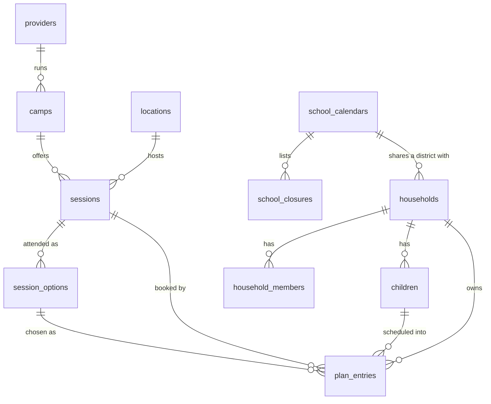

# Architecture

## Tech stack

| Layer | Choice | Notes |
|---|---|---|
| App | **Next.js 16 (App Router) + React 19**, TypeScript | Server Components read the catalog; Client Components own the grid and map. Hosted on Vercel. ADR-0003 |
| Database | **Supabase Postgres** | Normalized relational. Migrations in `supabase/migrations/`, committed and reviewed. ADR-0002 |
| Geo | **PostGIS** `geography(Point,4326)` + GiST | Proximity is one indexed `ST_DWithin`. Geocoding happens at verification time, never at query time. ADR-0007 |
| Auth | **Supabase Auth** (magic link) | The JWT drives RLS. ADR-0004 |
| Authorization | **Row Level Security** | The only boundary between households. Tested, not assumed. ADR-0004 |
| Files | **Supabase Storage** | Source PDFs captured when a record is verified. |
| Planner | **`@campout/planner`** (pnpm workspace, `private: true`) | Pure TS, no I/O, no clock. Runs server-side and in the browser. ADR-0008 |
| Maps | **MapLibre GL** + MapTiler tiles | Open-source renderer; tile provider swappable behind one env value. ADR-0007 |
| Styling | **Tailwind v4** + shadcn/ui | Tokens: the `@theme` block in `src/app/globals.css`; reasoning in `docs/DESIGN.md`. shadcn components live in `src/components/ui/`, restyled on those tokens. ADR-0015 |
| Tooling | Biome · tsc · Vitest · Playwright · Lefthook | ADR-0009 |
| Package manager | pnpm 11, Node 24 | `.nvmrc` pins 24. |

See `docs/adr/` for the "why" behind each choice.

## The two shapes that matter

**A provider is an organization, a camp is a program it runs, and a session is a dated offering of that program** (ADR-0018). The directory searches *sessions* — a parent shops for "the week of July 12", not for an organization. A camp page lists its sessions. Nearly every planner query starts at `sessions`, and getting this wrong would be the most expensive schema mistake available. A session offers one to three time options (`session_options`: full day, morning, afternoon), each with its own price, hours and care times, and meets at one standalone location that any camp's sessions can share.

**Every catalog record carries provenance, and only a reviewer publishes it** (ADR-0017). `providers`, `camps`, `locations`, `sessions` and `school_calendars` each carry a `status` (`draft`, `verified`, `archived`). `verified_at` and `verified_by` are required once a row is verified (`*_verified_recorded`) and are set only by `approve_record()`, which a guard trigger enforces even against the secret key. A check constraint — `*_provenance_present` — requires that **at least one of `source_url` and `source_document_path` is non-NULL**. That is the whole of what the database enforces: neither column being set is impossible, and nothing more is checked.

Everything else about evidence is a contract the verification workflow keeps, not a rule the database applies (ADR-0012):

- `source_document_path` holds an **object key inside the private `camp-sources` bucket**, with no bucket prefix. The constraint does not parse it.
- **Nothing verifies the object exists.** A path pointing at a file nobody uploaded satisfies the constraint. Keeping the two in step is the verifier's job, and a dangling path is a data-quality bug rather than something Postgres will catch.

Together this is how "we list camps, we do not vet them" is made true in the data rather than merely stated in the terms. `providers.website_url` and `camps.registration_url` are deliberately nullable: plenty of camps have no site and take registration by paper or phone.

**Facts the app computes with are columns; everything else is `details`** (ADR-0017 §5). `camps`, `sessions` and `session_options` each carry a `details` `jsonb` column checked on every write by `pg_jsonschema` against a fixed vocabulary, and read in the app only through `src/lib/db/details.ts`. The vocabulary is in `docs/data/camp-record-spec.md`.

## Data model

```mermaid
erDiagram
    providers ||--o{ camps : runs
    camps ||--o{ sessions : offers
    locations ||--o{ sessions : hosts
    sessions ||--o{ session_options : "attended as"
    households ||--o{ household_members : "has"
    households ||--o{ children : "has"
    households ||--o{ plan_entries : owns
    children ||--o{ plan_entries : "scheduled into"
    sessions ||--o{ plan_entries : "booked by"
    session_options ||--o{ plan_entries : "chosen as"
    school_calendars ||--o{ school_closures : "lists"
    school_calendars ||--o{ households : "shares a district with"
```

**Two halves with different rules:**

- **Catalog** (`providers`, `camps`, `locations`, `sessions`, `session_options`, `school_calendars`, `school_closures`) — **the public reads verified rows only**, and a session only when its camp, provider and location are verified too. Reviewers (`reviewers`, `is_reviewer()`) read drafts. A household reads whatever its own plan references, even once archived. Writes go through the service role (drafts), `approve_record()` and `reviewer_edit()`. Every write lands in `catalog_history`. Searched through one function, `search_sessions()`, which runs as definer and applies the same chain rule itself, so its date and category indexes work (under RLS they can't: the overlap operators aren't leakproof). The gate's RLS tests are release-blocking, like the household ones (ADR-0017).
- **Household** (`households`, `household_members`, `children`, `plan_entries`) — RLS-protected, resolved through `is_household_member()`. ADR-0004.

`children` holds a display name, an integer age, and a grade. **Nothing else, by design and by schema** — read ADR-0006 before altering that table.

## Planner package (`@campout/planner`)

At `packages/planner/`. Pure, framework-free TypeScript — no database client, no `fetch`, no React, no `process.env`, and **no reading of the wall clock**.

**Dual-use:** a route handler imports it to validate a plan; the browser imports it so the grid re-evaluates instantly as a parent drags a session into a cell. One implementation, two contexts.

**Enforced structurally, not by convention.** `packages/planner/tsconfig.json` compiles under `lib: ["ES2022"]` with **no DOM lib**, so a browser API inside the package is a compile error rather than a runtime failure on the server.

**The coverage primitive is a closure, not a summer (ADR-0013).** A closure is a contiguous run of days school is shut, carrying the district’s own words and a set of tags. **Summer is never stored:** no district publishes it, so it is derived from one year’s `lastInstructionalDay` and the next year’s `firstInstructionalDay`, and it is the same `CoveragePeriod` shape as a Tuesday off. What is stored is a `SchoolYearCalendar` (`school_calendars`) and its `Closure`s (`school_closures`). A calendar’s `type` (`traditional` or `year_round`) tells the UI what it may promise; it never changes the algorithm.

**The planner refuses rather than guesses.** A date we hold no calendar for throws, and so does a date past the last summer we can resolve — that is not the same as “school is in session”. Neighbouring years are paired by **label** (`2026-27`, then `2027-28`), so a summer between two held years is known even when each coverage window stops at the last day of school. A label that is not `YYYY-YY` throws. When the following year is absent, summer ends before an **estimated** first day back (ADR-0014): a Labor Day anchor, else the same weekday counted back from the end of the month, discarded outside Jul 1 – Sep 15. Nothing is stored, and every `CoveragePeriod` carries a `basis` (`published` or `estimated`, with the rule), so the UI can never show an estimate as the district's date. `longestPeriod` returns `undefined` when the gap holds no weekday, or when the following year is absent and no estimate passes the range check. A calendar that contradicts itself (a closure outside its instructional days, two closures sharing a day, overlapping years) throws. Early release days and grade-staggered start dates are deliberately out of scope (ADR-0013).

**The database does not enforce that a closure sits inside its calendar’s window** — a check constraint cannot read the parent row. The planner does, and a violation is a data-quality bug for the verification workflow to catch. On the catalog side there is nothing else to do for one-day camps: a one-day camp is already a `sessions` row with `start_date == end_date`.

**Dates are calendar dates.** `YYYY-MM-DD` strings, anchored to UTC midnight internally — not to make the values UTC, but to make the arithmetic immune to the reader's timezone. A camp running June 15–19 runs those days in Richmond no matter who is looking. Daily hours are wall-clock `time` values. Money is integer cents.

| Module | Status | Responsibility |
|---|---|---|
| `calendarDate.ts` | **shipped** | Date primitives: parse/validate, `addDays`, `mondayOf`, `nextWeekday`, `previousWeekday`, `firstWeekdayOnOrAfter`, `lastWeekdayOnOrBefore`. Rejects `2027-02-30`, which `Date.parse` silently rolls to March 2. |
| `weeks.ts` | **shipped** | `weeksBetween(start, end)` — a run of closed days in, the ordered Monday-anchored weeks out, with partial boundary weeks flagged. The subtlest code in the repo. The week-building loop is carried over from `summerWeeks()` unchanged; only its inputs changed. |
| `types.ts` | **shipped** | `SchoolDistrict`, `CalendarType`, `ClosureTag`, `PeriodBasis`, `EstimateRule`, `Closure`, `SchoolYearCalendar`, `CoveragePeriod` (`PublishedPeriod` \| `EstimatedPeriod`), `CoverageWeek`. |
| `calendars.ts` | **shipped** | Validates a list of `SchoolYearCalendar`s and puts them in date order. Throws on anything that contradicts itself. |
| `closures.ts` | **shipped** | `coveragePeriods()`, `longestPeriod()`, `coveragePeriodOf()` — every run of closed weekdays, summer included. The module everything else indexes off. ADR-0013 |
| `estimate.ts` | **shipped** | `estimateNextFirstDay()` — the likely first day of an unpublished next school year, so summer has an end before the district publishes it. ADR-0014 |
| `summers.ts` | **shipped** | `summerChoices(calendars, today)` — the summers a parent can pick (each between two loaded years, plus an estimated one only when it is the upcoming summer) and the upcoming default. CAM-31 |
| `coverage.ts` | not yet written | Uncovered weeks. |
| `overlap.ts` | not yet written | Two sessions for one child on the same day. |
| `hours.ts` | not yet written | A session ending before the household workday does. |
| `logistics.ts` | not yet written | Two children too far apart for one drop-off run. |

## Key files

| Path | Purpose |
|---|---|
| `AGENTS.md` | The working contract. Read before anything else. |
| `docs/adr/` | Decisions and rationale; immutable once accepted. |
| `docs/data/camp-record-spec.md` | Field-by-field catalog spec and the verification rules. |
| `docs/DESIGN.md` | Visual language — tokens, card anatomy, state signals, copy. Proposed, not locked. |
| `supabase/migrations/…_catalog.sql` | `camps`, `locations`, `sessions`, `school_calendars`, `school_closures`, PostGIS, `btree_gist`, catalog RLS |
| `supabase/migrations/…_catalog_review_gate.sql`, `…_plan_entries_options.sql` | The review gate (CAM-27, ADR-0017): `status` and the verified chain, `reviewers`/`is_reviewer()`, `approve_record()`, `reviewer_edit()`, the guard triggers and gate flag, `catalog_history`, and `plan_entries.option_id` with restrict deletes and the tightened insert policy |
| `supabase/migrations/…_catalog_shape.sql` | The provider → camp → session shape (CAM-27): `providers`, `session_options`, standalone locations with `find_location_duplicates()`, the seven categories, `details` and its vocabulary (`pg_jsonschema`), `closed_dates`, and `search_sessions()` with its indexes |
| `supabase/seed.sql` | An invented local catalog covering the shape. Loaded by `pnpm supabase:reset`. No real camps (ADR-0010). |
| `src/lib/db/types.ts` | Generated from the local schema by `pnpm db:types`. Never hand-edited. |
| `src/lib/db/details.ts` | The one typed reader of `details` (ADR-0017 §5). |
| `src/lib/db/enum-mirrors.ts` | Compile-time locks between the planner's enums and the database domains they mirror. |
| `supabase/migrations/…_source_documents.sql` | The private `camp-sources` bucket holding saved flyers, PDFs and screenshots (ADR-0012) |
| `supabase/migrations/…_households.sql` | `households`, `household_members`, `children`, `plan_entries`, `is_household_member()`, household RLS, and `create_household()` — the only path to a household (ADR-0011) |
| `packages/planner/src/` | The pure coverage engine (ADR-0008) |
| `src/app/page.tsx` | Redirects `/` to `/summer` (307) until Home exists. |
| `src/app/summer/page.tsx` | The Summer page: the family's summer plan (CAM-11), a placeholder until then. Sends a URL carrying `?summer=` or `?week=` on to `/camps` (307), where the finder moved (CAM-35, ADR-0016). |
| `src/app/camps/page.tsx` | The Find camps page's request boundary: reads Richmond's date from the clock and `?summer=` from the URL, and loads the session cards. |
| `src/app/camps/camps-view.tsx` | The Find camps page's body: the planner derives the summers in a Server Component; the chosen one drives the caption, the week picker and the cards. An unknown `?summer=` falls back to the upcoming summer. |
| `src/components/summer-weeks.tsx` | The week picker over the selected week's session cards. A Client Component: the week lives in `?week=`, read with `useSearchParams` and changed with `history.pushState`, so choosing a week makes no server round trip. |
| `src/components/session-card.tsx` | The session card (DESIGN.md → *The session card*). Renders a `SessionCardView`; never imports the catalog. |
| `src/lib/catalog/session-cards.ts` | The data-access service for session cards: `listSessionCards()` joins sessions to camp, provider and location as `SessionCardView`s. The only reader of the mock catalog; CAM-28 swaps it for Supabase. |
| `src/lib/session-card-format.ts`, `src/lib/week-sessions.ts` | The card's facts as a parent reads them (hours, ages, price, week tab, partial-week callout); which cards a week shows, and which week `?week=` selects. |
| `src/components/summer-chooser.tsx` | The summer chooser: one link per summer, the choice kept in the URL, marked with `aria-current`. |
| `src/lib/calendars/chesterfield.ts` | Chesterfield's school years, read from the parser's drafts in `docs/data/school-calendars/` until calendars are in Postgres (CAM-4). |
| `src/lib/today.ts` | `richmondDate(instant)` — the calendar date in Richmond at an instant. |
| `src/components/week-picker.tsx` | The week picker (DESIGN.md → *Filters*). A controlled Client Component: the page tells it the selected week and hears a new one. |
| `src/components/ui/` | shadcn/ui components on Campout tokens (ADR-0015). |
| `src/lib/utils.ts` | `cn`, taught Campout's type roles (ADR-0015). |
| `src/lib/dates.ts`, `src/lib/districts.ts` | Display formats for a `CalendarDate` and a `SchoolDistrict`. |
| `src/components/site-nav.tsx` | The top nav bar, rendered by the root layout (DESIGN.md → *Navigation*). Shows a Sign out button to a signed-in user (CAM-41). |
| `src/lib/supabase/` | The Supabase clients (CAM-41): `server.ts` for Server Components and route handlers, `browser.ts` for Client Components, `session.ts` for the proxy's session refresh. All use the publishable key; `env.ts` refuses to start without it. |
| `src/proxy.ts` | Refreshes the Supabase session on every page request, so a user stays signed in across reloads and new tabs (CAM-41). |
| `src/app/sign-in/` | The app's only sign-in page: one email field, a magic link, no password (CAM-41). `?next=` is where to land; `?error=link` is the failed-link message. |
| `src/app/auth/callback/route.ts`, `src/app/auth/sign-out/route.ts` | Finish a magic-link sign-in and return to `next` (or `/sign-in?error=link`); sign out with a POST and land on `/`. |
| `src/lib/auth/safe-next.ts` | `safeNextPath`: the one check that a `?next=` is a path on this site. |
| `.claude/hooks/tdd-guard.sh` | Test-integrity + ratchet guard (blocks the turn) |
| `.claude/hooks/privacy-guard.sh` | Child-data, RLS, and service-role guard (blocks the turn) |
| `.claude/agents/challenger.md` | Adversarial reviewer for the Automatic Code Review Protocol |
| `supabase/tests/` | The RLS policy suite — two households, two JWTs, real Postgres (ADR-0004) |
| `vitest.config.ts` | Two projects (`unit`, `rls`) and the two ratcheted coverage floors |
| `scripts/check-code-health.ts` | The absolute CodeScene ratchet. **Needs a project id before it does anything** — it exits 2 until then, rather than passing silently. |
| `.env.example` | Required env var names, no values |

## Known quirk: the coverage text report

Vitest's text reporter does not print `packages/planner/**` rows while they sit at 100%, even with `skipFull: false`. **The files are measured** — `coverage/lcov.info` lists all of them, and the 95% planner floor fails the build correctly when coverage drops (verified when the floor was set up). Read `coverage/lcov.info`, not the terminal table, if you need to confirm a file is covered.

## Environments

| Environment | Database | Notes |
|---|---|---|
| Local | `supabase start` (Docker) | `pnpm supabase:reset` re-applies migrations. Required for `pnpm test:rls`. |
| Live | Supabase project `campout` (`buxtoklftaiovuhjkqoi`, us-east-1) | Provisioned CAM-25. One project for now, doubling as Preview and Production — the split this table used to describe is a future decision, not yet built. `NEXT_PUBLIC_SUPABASE_URL`/`NEXT_PUBLIC_SUPABASE_PUBLISHABLE_KEY`/`SUPABASE_SECRET_KEY` point at it. |
